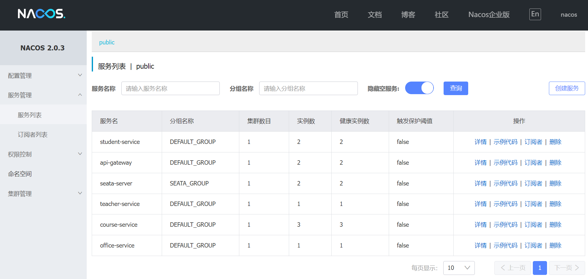
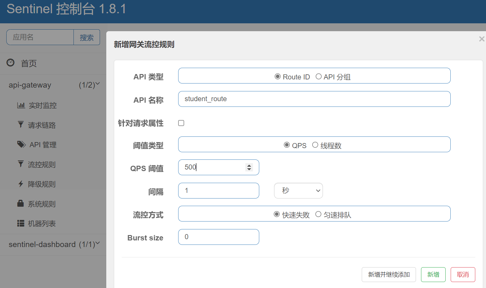
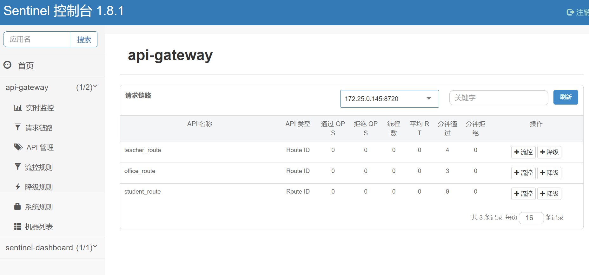
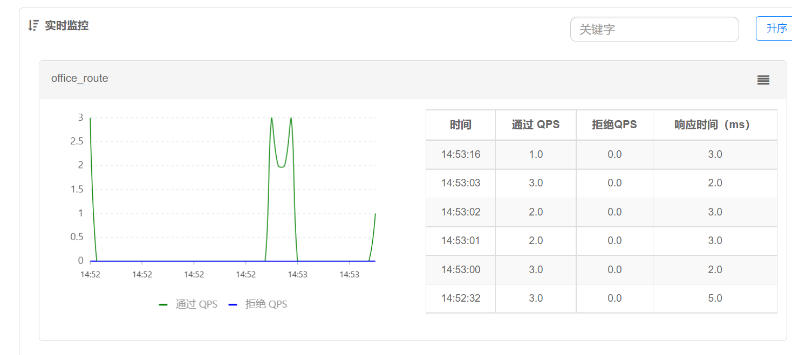
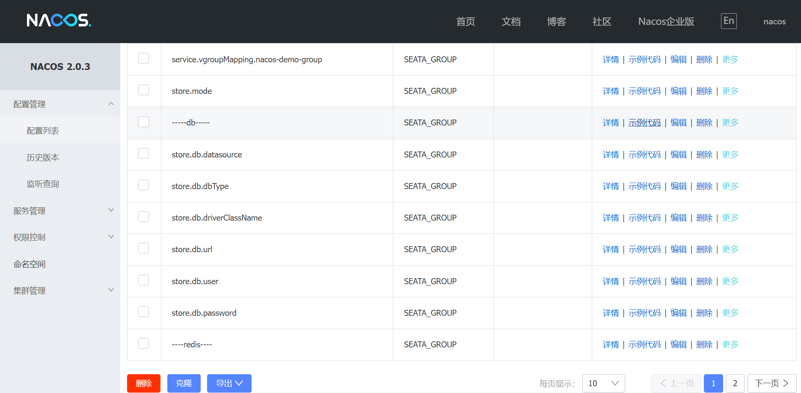

# 架构设计文档

部署文档请见：https://github.com/54ycf/Education-Management/blob/master/%E9%A1%B9%E7%9B%AE%E6%96%87%E6%A1%A3/%E9%83%A8%E7%BD%B2%E6%96%87%E6%A1%A3.md

更多请见：https://github.com/54ycf/Education-Management/tree/master/%E9%A1%B9%E7%9B%AE%E6%96%87%E6%A1%A3

以及接口文档：https://www.apifox.cn/apidoc/shared-26ad046a-1f80-4b30-be06-e3c21fde8509

## 展现层

1. Web前端
   基于HTML/HTML5/Vue/CSS3开发web前端页面，使用Element UI组件框架实现快速开发，兼容主流浏览器。
2. 其他
   采用前后端分离的开发模式，实现展现层和数据层完全分离，故在后续开发中前端可继续扩展为APP等其他平台。

## 通讯层

1. 基于阿里云CDN实现静态数据加速。
2. 基于HTTP 的通信方式，实现前后端数据通信。

## 服务层

1. 核心业务基于Spring Cloud 架构实现微服务化。Spring Cloud是一个基于Spring Boot实现的云应用开发工具，它为基于JVM的云应用开发中的配置管理、服务发现、断路器、智能路由、微代理、控制总线、全局锁、决策竞选、分布式会话和集群状态管理等操作提供了一种简单的开发方式。微服务是可以独立部署、水平扩展、独立访问（或者有独立的数据库）的服务单元，Spring Cloud可管理众多的微服务。
2. 在实际开发中，采用Spring Cloud Alibaba版本的开发工具。Spring Cloud Alibaba是Spring Cloud下的一个子项目，为分布式应用程序开发提供了一站式解决方案，它包含开发分布式应用程序所需的所有组件，可以轻松地使用Spring Cloud开发应用程序。
3. 整体框架设计：
   

### Nacos

1. Nacos服务启动于8848端口。
2. Nacos是Alibaba提供的注册中心，是针对微服务架构中的服务发现、配置管理、服务治理的综合型解决方案，可以实现资源的统一管理，包括业务层的微服务，网关微服务，Seata服务器等等。
3. 同一个打包好的微服务可以在不同地址和不同端口进行启动，注册到Nacos，在集成OpenFeign进行访问和网关进行转发时可以自动进行负载均衡，可以十分方便地进行横向拓展。

### Nginx

1. Nginx实现服务器的反向代理，所有http请求到80端口由Nginx进行转发。
2. 实现了动静分离，通过url分别实现动态资源和静态资源的请求。
3. 实现负载均衡。Nginx对请求可以分别转发到本机28081和28088端口，减少网关微服务的压力。

### 网关微服务

1. 通过识别url进行路径转发。对请求的url进行过滤和断言，通过集成的Nacos服务，快速发现应该转发到某个业务层的微服务的地址。
2. 为了减小单一网关微服务的压力，故在服务器分别于28087和28088启动了两个微服务，利用Nginx进行轮询访问。
3. 网关在转发到微服务时，通过Nacos注册的不同的业务微服务的实例，也可以转发到不同的端口进行负载均衡。如student-service分别于28080和28081端口启动，在转到该微服务时即可进行随机策略的负载均衡。

### Sentinel

1. 控制面板启动在9090端口。
2. 可以对网关转发的请求进行流量控制，通过限制QPS或者限制进程数进行控制。策略有快速失败和匀速排队。此处选择快速失败。

### 业务微服务

#### 学生微服务

1. 负责学生的登陆，学生信息的增删改查。
2. 可以对课表进行操作，成绩进行质疑。在进行此接口调用时，会利用OpenFeign去调用课程微服务的接口。同时会使用随机访问的策略进行负载均衡调用。
3. 通过在28080和28081端口启动两个微服务来分担访问压力。

#### 教师微服务

1. 负责教师的登陆，教师信息的增删改查。
2. 可以填写学生成绩与核实。同样会利用OpenFeign去访问课程微服务接口。
3. 启动在28082端口

#### 教务微服务

1. 负责教务的登陆，教务信息的获取。
2. 负责学生信息的管理，此时调用学生微服务。
3. 负责教师信息的管理，此时调用教师微服务。
4. 负责课表的管理，课程的安排，调用课程微服务。
5. 启动在28083端口。

#### 课程微服务

1. 负责对课程的所有操作，可以被学生微服务，教师微服务，教务微服务调用。
2. 启动在28084、280805、28086端口。

### SEATA

1. Seata 是一款开源的分布式事务解决方案，致力于在微服务架构下提供高性能和简单易用的分布式事务服务。
2. Seata的AT 模式提供无侵入自动补偿的事务模式，支持MySQL等数据库的分布式问题解决。
3. 分布式的MySQL数据库中额外建立一张undo_log表来进行事务管理。并额外建立一个seata_server数据库用于事务数据的回滚。
4. 将Seata的配置项注册到Nacos的配置中心，在seata-server启动的时候会进行自动配置。
5. Seata也可以集群部署。将Seata服务器启动在8091和8092端口，并注册到Nacos中，在微服务进行数据库访问的时候调用seata服务。

nacos配置中心对seata服务的配置

## 数据层

1. 使用MySQL存储事务性数据，以及关联性较强的数据。如学生信息，教师信息，课表信息，学生选课信息等。
2. 将数据库分为用户数据库和课程数据库，用户数据库存放老师，学生和教务的个人信息，课程数据库存放课程信息、课表信息和选课信息与成绩。两个数据库采用分布式部署。
3. 分布式MySQL结合服务层的seata-server保证事务的ACID。需每个数据库额外添加undo_log表以记录锁信息，并且额外添加seata_server数据库以存储每次业务更新的数据的镜像以确保数据可以正常回滚。

# 其他

项目部分服务使用到Docker进行部署，将在部署文档中提到。
